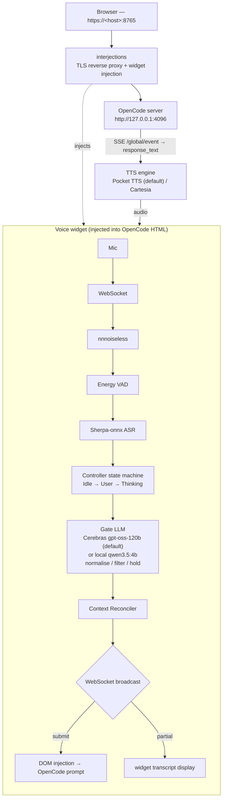

# interjections

Voice layer for OpenCode web — speak naturally into your mic, ASR transcribes locally, text is injected into OpenCode's prompt, and the assistant's response is read aloud via TTS.

Interjections runs as a **TLS reverse proxy** in front of `opencode web`, injecting a voice widget into the HTML page. It handles the full voice pipeline: noise suppression, VAD, local ASR (Sherpa-onnx), a gate LLM (Cerebras gpt-oss-120b by default, or local qwen3.5:4b via Ollama) that normalises and filters utterances before submission, and streaming TTS.

## Architecture



### TTS engines

TTS is pluggable via a `Tts` trait with two implementations, selected by `tts_engine` (`IJ_TTS_ENGINE` env / `--tts-engine` flag):

| Engine | Value | Description |
|---|---|---|
| **Pocket TTS** | `pocket` (default) | Kyutai Pocket TTS — local, CPU-only, ~100 M params, ~59 ms first-chunk latency, zero VRAM. Model loaded once at startup. |
| **Cartesia** | `cartesia` | Cartesia Sonic-3 — cloud fallback; requires `CARTESIA_API_KEY`. |

The default is `pocket`. A fresh checkout will fail fast at startup until the model assets are provisioned (see Setup step 4 below). Pass `--tts-engine cartesia` to use the cloud fallback without provisioning.

## Setup

### Quick start (recommended)

```bash
./scripts/up.sh
```

An interactive wizard: it asks which gate and TTS engine you want, prompts for
any missing API keys (saving them to `.env`), does the one-time setup for what
you chose (ASR model, TLS certs, Pocket TTS provisioning), builds a release
binary, and launches `opencode web` + interjections. Re-running goes straight to
launch; `./scripts/up.sh --reconfigure` re-asks the questions.

The manual steps below are the equivalent, if you'd rather set things up by hand.

### 1. System requirements

- **Rust 1.75+** (`rustup update stable`)
- **Linux** with ALSA dev libraries:

  ```bash
  sudo apt install libasound2-dev
  ```

### 2. ASR model (Sherpa-onnx)

Download the streaming Zipformer English model and place it at `data/models/sherpa-zipformer-en/`:

```bash
mkdir -p data/models
wget https://github.com/k2-fsa/sherpa-onnx/releases/download/asr-models/sherpa-onnx-streaming-zipformer-en-2023-06-26.tar.bz2
tar -xjf sherpa-onnx-streaming-zipformer-en-2023-06-26.tar.bz2
mv sherpa-onnx-streaming-zipformer-en-2023-06-26 data/models/sherpa-zipformer-en
rm sherpa-onnx-streaming-zipformer-en-2023-06-26.tar.bz2
```

### 3. Gate LLM

The gate LLM normalises and filters voice utterances before they reach OpenCode. It fails open — if the gate is unreachable, the raw transcript is submitted (you lose the "wait, more is coming" hold behavior, not the whole loop).

**Default: Cerebras `gpt-oss-120b`** (fastest + best hold accuracy in the eval; see ADR-0005). Set the key — `IJ_GATE_API_KEY`, or it falls back to `CEREBRAS`:

```bash
export CEREBRAS="csk-..."   # https://cloud.cerebras.ai
```

**Local fallback: `qwen3.5:4b` via Ollama** (fully offline, no key):

```bash
# Install Ollama: https://ollama.com/download
ollama pull qwen3.5:4b
ollama serve   # must be running on localhost:11434
# then point the gate at it:
interjections --web \
  --gate-endpoint http://localhost:11434/v1/chat/completions \
  --gate-model qwen3.5:4b \
  --gate-reasoning-effort none
```

### 4. Local TTS — Pocket TTS (default engine)

Pocket TTS uses gated model weights hosted on HuggingFace. One-time setup required:

**a. Accept the license.** Log in to HuggingFace and click **"Agree and access repository"** at:
https://huggingface.co/kyutai/pocket-tts

**b. Create a HuggingFace read token** (if you don't have one):
https://huggingface.co/settings/tokens

**c. Run the provisioning script once:**

```bash
HF_TOKEN=hf_… ./scripts/fetch-pocket-tts.sh
```

This downloads the gated weights into the HF cache (`~/.cache/huggingface`) and places a default voice WAV at `data/models/pocket-tts/voice.wav`. After this step, runtime requires no token — the loader reads the local cache.

> If you want to skip local TTS setup for now, use `--tts-engine cartesia` (see step 5).

### 5. Cloud TTS — Cartesia (optional fallback)

```bash
export CARTESIA_API_KEY="sk_car_..."
# then run with:
cargo run -- --web --tts-engine cartesia
```

### 6. OpenCode

```bash
opencode web --port 4096
```

Set credentials for the reverse proxy's Basic auth:

```bash
export OPENCODE_USERNAME="opencode"
export OPENCODE_PASSWORD="..."
```

### 7. TLS certificates

`getUserMedia` (browser mic access) requires a secure context. Interjections serves TLS on port 8765 and needs a certificate and key:

```bash
# Defaults (relative to working directory):
certs/cert.pem
certs/key.pem

# Or set via environment:
export TLS_CERT_PATH=/path/to/cert.pem
export TLS_KEY_PATH=/path/to/key.pem
```

For local development a self-signed cert works; the browser will warn once and then allow mic access after you accept the exception.

## First run (happy path)

```bash
# 1. ASR model
mkdir -p data/models
wget -qO- https://github.com/k2-fsa/sherpa-onnx/releases/download/asr-models/sherpa-onnx-streaming-zipformer-en-2023-06-26.tar.bz2 \
  | tar -xjf - && mv sherpa-onnx-streaming-zipformer-en-2023-06-26 data/models/sherpa-zipformer-en

# 2. Gate LLM (default: Cerebras — just set the key)
export CEREBRAS="csk-..."   # or, for the local fallback: ollama pull qwen3.5:4b && ollama serve &

# 3. Pocket TTS weights (accept HF license first, then create a token)
HF_TOKEN=hf_… ./scripts/fetch-pocket-tts.sh

# 4. TLS certs (self-signed, one-time)
mkdir -p certs
openssl req -x509 -newkey rsa:2048 -keyout certs/key.pem -out certs/cert.pem \
  -days 365 -nodes -subj "/CN=localhost"

# 5. Start OpenCode
opencode web --port 4096 &

# 6. Start interjections
export OPENCODE_USERNAME="opencode"
export OPENCODE_PASSWORD="your-password"
cargo run -- --web

# 7. Open in browser
# https://<host>:8765
```

## CLI Options

```
--web                        Start web interface (reverse proxy + voice widget)
--port <PORT>                Web server port (default: 8765)
--host <HOST>                Web server host (default: 0.0.0.0)
--debug                      Enable debug logging
--tts-engine <ENGINE>        TTS engine: pocket (default) or cartesia (IJ_TTS_ENGINE)
--cartesia-key <KEY>         Cartesia API key — only used with --tts-engine cartesia (CARTESIA_API_KEY)
--sherpa-model-dir <DIR>     Sherpa-onnx model directory (default: data/models/sherpa-zipformer-en)
--opencode-url <URL>         OpenCode server URL (default: http://127.0.0.1:4096)
--gate-endpoint <URL>        Gate LLM endpoint (default: https://api.cerebras.ai/v1/chat/completions) (IJ_GATE_ENDPOINT)
--gate-model <MODEL>         Gate LLM model (default: gpt-oss-120b) (IJ_GATE_MODEL)
--gate-api-key <KEY>         Gate LLM API key — falls back to CEREBRAS env (IJ_GATE_API_KEY)
--gate-reasoning-effort <E>  No-think switch: low (gpt-oss) | none (ollama qwen) (IJ_GATE_REASONING_EFFORT)
--no-gate                    Bypass the gate and submit raw ASR transcripts
```

## Environment

```
# TTS
IJ_TTS_ENGINE=pocket           TTS engine: pocket (default) or cartesia

# Cartesia — only required when IJ_TTS_ENGINE=cartesia
CARTESIA_API_KEY=sk_car_...

# Gate LLM (defaults to Cerebras gpt-oss-120b)
IJ_GATE_ENDPOINT=https://api.cerebras.ai/v1/chat/completions
IJ_GATE_MODEL=gpt-oss-120b
IJ_GATE_REASONING_EFFORT=low   (low for gpt-oss; none for ollama qwen)
IJ_GATE_API_KEY=               (gate key; falls back to CEREBRAS when unset)
CEREBRAS=csk-...               (used as the gate key if IJ_GATE_API_KEY is unset)
# Local fallback: --gate-endpoint http://localhost:11434/v1/chat/completions --gate-model qwen3.5:4b --gate-reasoning-effort none

# OpenCode
OPENCODE_USERNAME=opencode
OPENCODE_PASSWORD=...

# TLS
TLS_CERT_PATH=certs/cert.pem   (default: certs/cert.pem)
TLS_KEY_PATH=certs/key.pem     (default: certs/key.pem)
```

## How It Works

1. **Reverse proxy** — all HTTP requests to `:8765` are forwarded to the OpenCode server at `:4096`. HTML responses are intercepted and a voice widget `<div>` + `<script>` is injected before `</body>`.

2. **Voice widget** — a floating mic button at the bottom-right. Clicking opens a WebSocket to the interjections server. Mic audio is captured via `ScriptProcessor`, downsampled to 16kHz PCM, and sent over the WebSocket.

3. **ASR pipeline** — server receives PCM chunks → nnnoiseless noise suppression → energy VAD → Sherpa-onnx streaming ASR. Partial results are broadcast back to the widget for real-time transcript display.

4. **Gate LLM** — when ASR produces a final utterance, it is sent to qwen3.5:4b (via Ollama) for normalisation and filtering. The gate can hold (request more speech), approve (clean up and submit), or discard (drop noise/backchannels). It fails open: if the model is unreachable the raw transcript is submitted.

5. **State machine** — `Idle` → `User` (VAD detects speech) → `Thinking` (ASR endpoint detected). Context reconciler collapses turns, handling interjection/correction cues ("wait", "actually", etc.).

6. **DOM injection** — when the reconciler produces final text, a `"submit"` message is sent to the widget. The widget's `ijInjectText()` uses `document.execCommand('insertText')` + submit button click to push text into OpenCode's SolidJS prompt input.

7. **SSE listener + TTS** — after submitting, the server connects to OpenCode's `GET /global/event` SSE endpoint, listens for `message.part.delta` events for the session, accumulates the response text, and on `message.updated` with `finish: "stop"`, calls the active TTS engine and streams audio chunks back to the widget.

## Project Structure

```
src/
├── main.rs        # Entry point, audio capture thread, ASR task loop
├── config.rs      # CLI args, env vars, defaults
├── audio.rs       # Mic capture (cpal), noise suppression (nnnoiseless), output, resampling
├── vad.rs         # Energy-based VAD (threshold + min speech/silence frames)
├── local_asr.rs   # Sherpa-onnx streaming ASR
├── tts.rs         # Tts trait + PocketTts + CartesiaTts; tts::build factory
├── cues.rs        # Lexical cue detection (interjection, correction, backchannel)
├── reconciler.rs  # Turn buffer with status tracking, correction collapsing
├── controller.rs  # State machine (Idle → User → Thinking), broadcast channels
└── web.rs         # TLS reverse proxy, WebSocket handler, SSE listener + TTS relay, voice widget

scripts/
├── up.sh                 # Setup wizard + launcher (recommended entry point)
└── fetch-pocket-tts.sh   # One-time Pocket TTS model + voice provisioning
```

## Docs

- `docs/plan.md` — full architecture plan, build-up phases, latency budget
- `docs/handoff.md` — detailed handoff notes, blocker analysis, OpenCode frontend details
- `docs/decisions/` — architecture decision records (ADRs)
